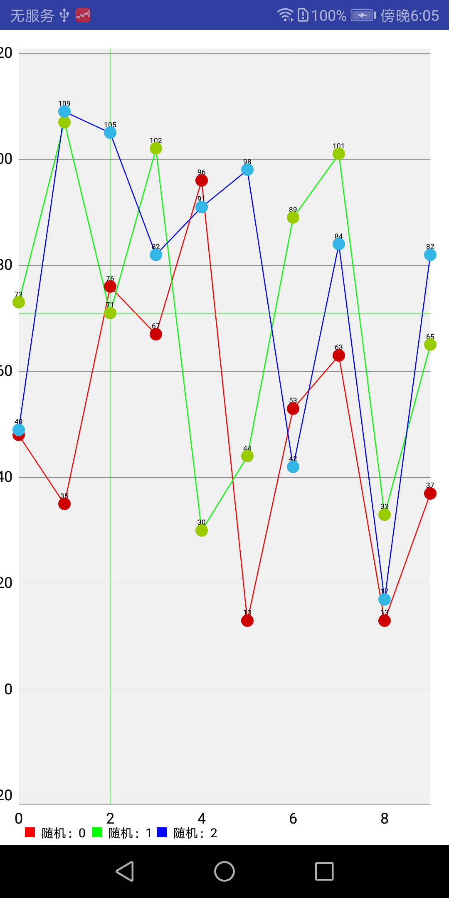

#折线图

LineChart初始化如下：

```java
  private void initLineChart() {
            // 是否显示数据描述
            lineChart.getDescription().setEnabled(false);
            // 没有数据的时候，显示“暂无数据”
            lineChart.setNoDataText("暂无数据");
            // 是否显示表格颜色
            lineChart.setDrawGridBackground(true);
//            lineChart.setGridBackgroundColor(Color.RED);
            // 是否可以缩放
            lineChart.setScaleEnabled(true);
            // 不显示y轴右边的值
            lineChart.getAxisRight().setEnabled(false);
            //设置显示数据的动画执行时间
            lineChart.animateX(2000);
            // 不显示图例
            Legend legend = lineChart.getLegend();
            legend.setEnabled(true);
            // 向左偏移15dp，抵消y轴向右偏移的30dp
            lineChart.setExtraLeftOffset(-15);

            XAxis xAxis = lineChart.getXAxis();
            // 不显示x轴
            xAxis.setDrawAxisLine(true);
            // 设置x轴数据的位置
            xAxis.setPosition(XAxis.XAxisPosition.BOTTOM);
            // 设置X轴坐标字体颜色
            xAxis.setTextColor(Color.BLACK);
//            xAxis.setValueFormatter(new IAxisValueFormatter() {
//                @Override
//                public String getFormattedValue(float value, AxisBase axis) {
//                    return null;
//                }
//            });
            xAxis.setTextSize(12);
            xAxis.setGridColor(Color.parseColor("#30FFFFFF"));
            // 设置x轴数据偏移量
//            xAxis.setYOffset(-12);

            YAxis yAxis = lineChart.getAxisLeft();
            // 是否显示左侧y轴
            yAxis.setDrawAxisLine(true);
            // 设置y轴数据的位置
            yAxis.setPosition(YAxis.YAxisLabelPosition.OUTSIDE_CHART);
            // 是否从y轴发出横向直线（Y轴坐标的数据的标记线）
            yAxis.setDrawGridLines(true);
            // 设置Y轴坐标字体颜色
            yAxis.setTextColor(Color.BLACK);
            yAxis.setTextSize(12);
            // 设置y轴数据偏移量
//            yAxis.setXOffset(30);
//            yAxis.setYOffset(-3);
            yAxis.setAxisMinimum(1);

//            Matrix matrix = new Matrix();
//            // x轴缩放1.5倍
//            matrix.postScale(1.5f, 1f);
//            // 在图表动画显示之前进行缩放
//            lineChart.getViewPortHandler().refresh(matrix, lineChart, false);

            lineChart.invalidate();
        }

```
单线简单设置数据如下：
```java
 private void setLineChartData(List<Entry> list) {
            if (lineChart.getData() != null && lineChart.getData().getDataSetCount() > 0) {
                LineDataSet lineDataSet = (LineDataSet) lineChart.getData().getDataSetByIndex(0);
                lineDataSet.setValues(list);
                lineChart.getData().notifyDataChanged();
                lineChart.notifyDataSetChanged();
            } else {
                LineDataSet lineDataSet = new LineDataSet(list, "Y轴数据");
                // 设置连接线的颜色
                lineDataSet.setColor(Color.parseColor("#FFFFFF"));
                // 设置连接线的类型（曲线或直线==）
                lineDataSet.setMode(LineDataSet.Mode.LINEAR);
                // 是否显示坐标点的小圆点（就是Entry数据的第三个参数）
                lineDataSet.setDrawCircles(true);
                // 是否显示坐标点的数据
                lineDataSet.setDrawValues(true);
                // 是否显示定位线
                lineDataSet.setHighlightEnabled(true);
                //设置定位线的颜色
//                lineDataSet.setHighLightColor();
                LineData data = new LineData(lineDataSet);
                lineChart.setData(data);
                lineChart.invalidate();
            }

        }
```
多线数据显示：
```java
        /**
         * 设置数据
         * @param lineDataSetBeanList 数据列表
         */
        private void setAllLineChartData(List<LineDataSetBean> lineDataSetBeanList) {
            if (lineDataSetBeanList==null || lineDataSetBeanList.size()<=0){
                return;
            }
            if (lineChart.getData() != null && lineChart.getData().getDataSetCount() > 0) {
                LineData data = lineChart.getData();
                for (LineDataSetBean bean : lineDataSetBeanList) {
                    boolean containOldData = false;
                    for (ILineDataSet iLineDataSet : data.getDataSets()) {
                        if (iLineDataSet instanceof LineDataSet) {
                            LineDataSet lineDataSet = (LineDataSet) iLineDataSet;
                            if (bean.getLabel().equals(lineDataSet.getLabel())) {
                                lineDataSet.setValues(bean.getEntryList());
                                containOldData = true;
                                break;
                            }
                        }

                    }
                    if (!containOldData) {
                        LineDataSet lineDataSet = new LineDataSet(bean.getEntryList(), bean.getLabel());
                        initLineDataSet(lineDataSet, bean);
                        data.addDataSet(lineDataSet);
                    }
                }
                data.notifyDataChanged();
                lineChart.notifyDataSetChanged();
            } else {
                LineData data = new LineData();
                for (LineDataSetBean bean : lineDataSetBeanList) {
                    LineDataSet lineDataSet = new LineDataSet(bean.getEntryList(), bean.getLabel());
                    initLineDataSet(lineDataSet, bean);
                    data.addDataSet(lineDataSet);

                }
                lineChart.setData(data);
                lineChart.invalidate();
            }
        }


        private void initLineDataSet(LineDataSet lineDataSet, LineDataSetBean bean) {
            // 设置连接线的颜色
            lineDataSet.setColor(bean.getColor());
            // 设置连接线的类型（曲线或直线==）
            lineDataSet.setMode(bean.getLineDataSetMode());
            // 是否显示坐标点的小圆点（就是Entry数据的第三个参数）
            lineDataSet.setDrawCircles(bean.isShowDrawCircles());
            // 是否显示坐标点的数据
            lineDataSet.setDrawValues(bean.isShowDrawValues());
            // 是否显示定位线
            lineDataSet.setHighlightEnabled(bean.isShowHighlightEnabled());
            //设置定位线的颜色
            lineDataSet.setHighLightColor(bean.getHighLightColor());
        }
```
其中的LineDataSetBean是我对数据做了简单处理。